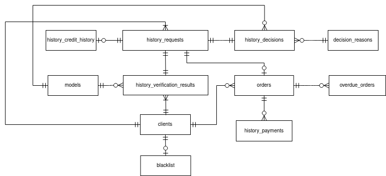
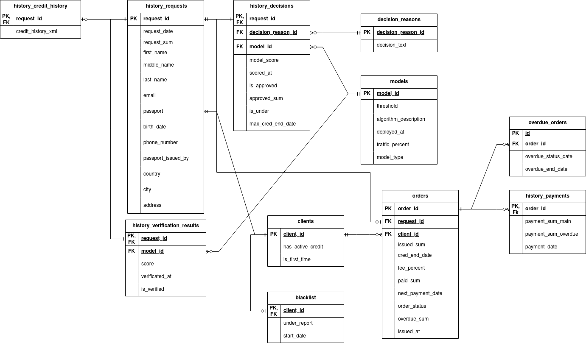

## Microcredit system pipeline

#### Development

1. Start `docker` on your machine.
2. Install requirements.

```
pip install -r requirements.txt
```
3. Build docker container.
```
bash scripts/start.sh
```
4. Using `POSTGRES_USER`, `POSTGRES_PASSWORD`, and `POSTGRES_DB` connect to database.
5. Contribute.
6. Shutdown database.
```
bash scripts/shutdown
```

#### Models

1. Conceptual Model


2. Logical Model
